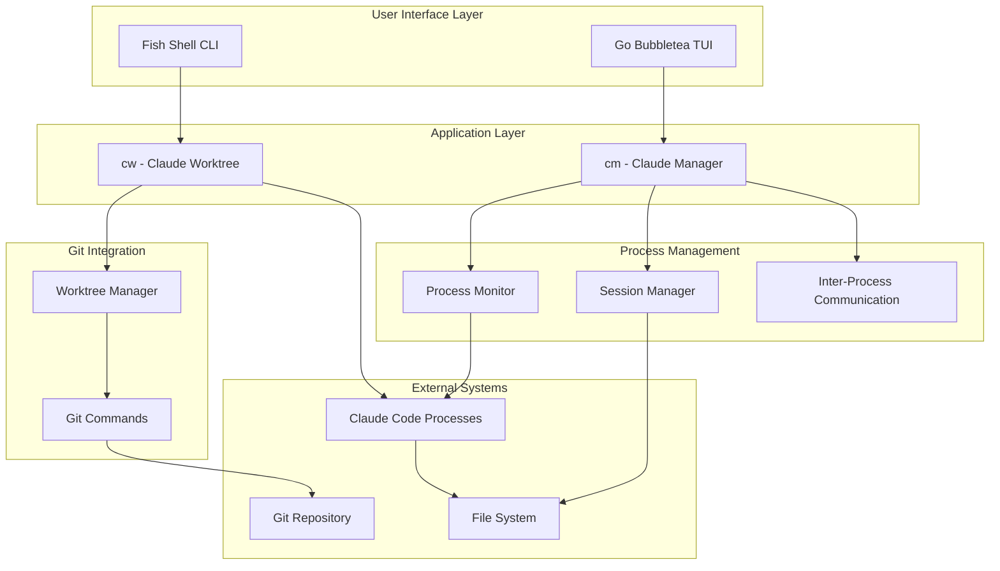

# Claude Development Suite - Architecture

## System Overview

The Claude Development Suite consists of two complementary tools designed to enhance parallel development workflows with Claude Code and git worktrees.

## High-Level Architecture



## Component Architecture

### 1. CW (Claude Worktree) - Fish Shell Function

**Purpose**: Create and manage git worktrees with Claude Code sessions

```
┌─────────────────────────────────────────────────────────────────┐
│                     CW (Claude Worktree)                        │
├─────────────────────────────────────────────────────────────────┤
│  Functions:                                                     │
│  ┌─────────────────┐  ┌─────────────────┐  ┌─────────────────┐ │
│  │      cw         │  │   _cw_make      │  │   _cw_list      │ │
│  │  Main Router    │  │ Create Worktree │  │ List Worktrees  │ │
│  └─────────────────┘  └─────────────────┘  └─────────────────┘ │
│  ┌─────────────────┐  ┌─────────────────┐  ┌─────────────────┐ │
│  │  _cw_remove     │  │   _cw_prune     │  │   _cw_help      │ │
│  │ Remove Worktree │  │ Clean References│  │ Show Help       │ │
│  └─────────────────┘  └─────────────────┘  └─────────────────┘ │
├─────────────────────────────────────────────────────────────────┤
│  Operations:                                                    │
│  • Interactive prompts for worktree configuration              │
│  • Git worktree creation and management                        │
│  • Environment setup (npm install, .env copying)               │
│  • Claude Code process launching                               │
│  • Error handling and validation                               │
└─────────────────────────────────────────────────────────────────┘
```

### 2. CM (Claude Manager) - Go TUI Application

**Purpose**: Monitor and control multiple Claude Code sessions

```
┌─────────────────────────────────────────────────────────────────┐
│                    CM (Claude Manager)                          │
├─────────────────────────────────────────────────────────────────┤
│                    Bubbletea Application                        │
│  ┌─────────────────┐  ┌──────────────────┐  ┌─────────────────┐ │
│  │     Model       │  │     Update       │  │      View       │ │
│  │                 │  │                  │  │                 │ │
│  │ • Sessions[]    │  │ • Event Handler  │  │ • Layout Engine │ │
│  │ • Selected      │  │ • State Machine  │  │ • Component     │ │
│  │ • Status        │  │ • Command Router │  │   Rendering     │ │
│  │ • Channels      │  │ • Update Logic   │  │ • Styling       │ │
│  └─────────────────┘  └──────────────────┘  └─────────────────┘ │
├─────────────────────────────────────────────────────────────────┤
│                     Concurrent Workers                         │
│  ┌─────────────────┐  ┌─────────────────┐  ┌─────────────────┐ │
│  │ Process Monitor │  │ Status Updater  │  │ Command Sender  │ │
│  │                 │  │                 │  │                 │ │
│  │ • Watch PIDs    │  │ • Health Checks │  │ • IPC Handler   │ │
│  │ • Process Trees │  │ • State Updates │  │ • Named Pipes   │ │
│  │ • Resource Use  │  │ • Event Stream  │  │ • FIFO Queues   │ │
│  └─────────────────┘  └─────────────────┘  └─────────────────┘ │
├─────────────────────────────────────────────────────────────────┤
│                     Session Manager                            │
│  ┌─────────────────────────────────────────────────────────────┐ │
│  │ • Session Discovery (ps, /proc parsing)                    │ │
│  │ • Git Worktree Detection (git worktree list)               │ │
│  │ • Process Lifecycle Management                             │ │
│  │ • Configuration Persistence                                │ │
│  │ • Resource Monitoring                                      │ │
│  └─────────────────────────────────────────────────────────────┘ │
└─────────────────────────────────────────────────────────────────┘
```

## Data Flow

### Session Creation Flow (CW)

```
User Input → Fish Function → Git Worktree → Environment Setup → Claude Launch
    ↓             ↓              ↓              ↓                 ↓
 cw make    Interactive     git worktree    npm install      claude <prompt>
            Prompts         add command     .env copy        
```

### Session Monitoring Flow (CM)

```
Process Discovery → State Management → UI Updates → User Interaction
       ↓                 ↓               ↓              ↓
   ps/procfs         Channel Updates   Bubbletea     Keyboard/Mouse
   scanning          to Model          Rendering      Events
```

## Inter-Process Communication

### Process Discovery

1. **System Process Scanning**: Use `ps` command and `/proc` filesystem
2. **Claude Process Identification**: Match process names containing "claude"
3. **Working Directory Detection**: Extract `cwd` from process information
4. **Git Context Resolution**: Run `git` commands in detected directories

### Communication Channels

```go
type SessionUpdate struct {
    SessionID string
    Status    SessionStatus
    Data      interface{}
}

type CommandRequest struct {
    SessionID string
    Command   CommandType
    Payload   string
}
```

### IPC Mechanisms

1. **Process Monitoring**: Direct process inspection via system calls
2. **File Watching**: Monitor log files and state files
3. **Named Pipes**: For command sending (future enhancement)
4. **Signals**: For process control and lifecycle management

## State Management

### Session State Model

```go
type ClaudeSession struct {
    ID           string            `json:"id"`
    Name         string            `json:"name"`
    Path         string            `json:"path"`
    Branch       string            `json:"branch"`
    PID          int               `json:"pid"`
    Status       SessionStatus     `json:"status"`
    LastSeen     time.Time         `json:"last_seen"`
    LastPrompt   string            `json:"last_prompt"`
    LastResponse string            `json:"last_response"`
    CreatedAt    time.Time         `json:"created_at"`
    Metadata     map[string]string `json:"metadata"`
}

type SessionStatus int

const (
    StatusUnknown SessionStatus = iota
    StatusActive
    StatusIdle
    StatusWorking
    StatusError
    StatusTerminated
)
```

### Persistence Layer

- **Configuration**: `~/.config/claude_manager/config.json`
- **Session State**: `~/.config/claude_manager/sessions.json`
- **Logs**: `~/.local/share/claude_manager/logs/`

## Performance Considerations

### Concurrency Model

1. **Main UI Thread**: Bubbletea event loop
2. **Process Monitor Thread**: Continuous system scanning
3. **Update Aggregator Thread**: Batches updates to prevent UI flooding
4. **Command Handler Thread**: Processes user commands asynchronously

### Resource Management

- **Memory**: Session state kept minimal, logs rotated
- **CPU**: Efficient process scanning with configurable intervals
- **I/O**: Batch file operations, async command execution

### Scalability Targets

- Support for 50+ concurrent Claude sessions
- Sub-100ms UI response time
- Memory usage under 50MB
- CPU usage under 5% when idle

## Security Considerations

### Process Access

- Read-only process inspection
- No privilege escalation required
- Safe process termination only

### File System Access

- Limited to user-owned directories
- No system file modification
- Configuration files with appropriate permissions

### Network

- No network communication required
- All operations are local to the system

## Extension Points

### Plugin Architecture (Future)

```go
type Plugin interface {
    Name() string
    Version() string
    Init(context.Context) error
    HandleEvent(Event) error
    Cleanup() error
}
```

### Custom Commands

```go
type CustomCommand struct {
    Name        string
    Description string
    Handler     func(Session, []string) error
}
```

### Integration Hooks

- Pre/post worktree creation hooks
- Session lifecycle callbacks
- Custom status indicators
- External tool integration